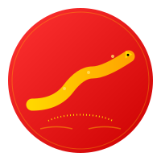

  
  <h1>Snake Game Library</h1>
  
A flexible and extensible snake game library powered by DeepSeek AI

  

    
    
    
  

# Snake Game Library

A flexible and extensible snake game library that can be easily integrated into various Python projects.

## Overview
Snake Game Library is a modern, event-driven implementation of the classic snake game, designed with extensibility and modularity in mind. It provides a robust foundation for building snake game variants and can be easily integrated into larger projects.

🤖 **AI-Powered Development**: This project is developed with the assistance of DeepSeek AI, leveraging advanced AI capabilities to ensure:
- Optimal code architecture
- Best programming practices
- Comprehensive documentation
- Intelligent game mechanics

## Features

### Core Features
- Event-driven architecture
- Separation of core game logic and display logic
- Full type annotations for better development experience
- Zero external dependencies
- Cross-platform compatibility

### Game Mechanics
- Classic snake movement and growth
- Multiple food types:
  - Normal food (basic points)
  - Golden food (bonus points)
  - Speed food (temporary speed boost)
  - Ghost food (wall passing ability)
  - Shrink food (reduces length)

### Advanced Features
- Save/Load system with JSON persistence
- Achievement system with multiple levels
- Obstacle system:
  - Static walls
  - Portals for teleportation
  - Temporary obstacles
  - Deadly spikes
- Multiplayer support:
  - Local multiplayer up to 4 players
  - Network play capability
  - Player collision detection

## Project Structure

## Installation
